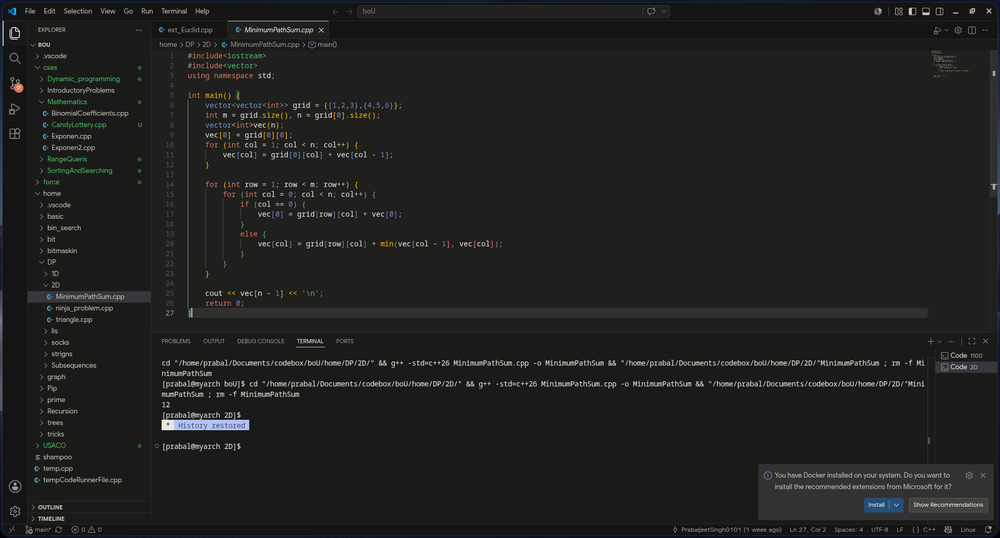

# Claude Code Dark Theme

> *The Claude feeling, now in your editor.*

A dark theme extracted directly from the official **Claude Code CLI** binaries — the real palette, mapped 1:1 to VS Code.

## 🚀 Install

1. Open VS Code → Extensions (`Ctrl+Shift+X`)
2. Search **"Claude Code Dark"**
3. Click Install → Set as Color Theme

## 💡 About

Every color — surfaces, accents, errors, warnings, git states — was pulled from Anthropic's own terminal palette. Same calm, same focus, just in VS Code now.

## 📸 Previews

### C++
